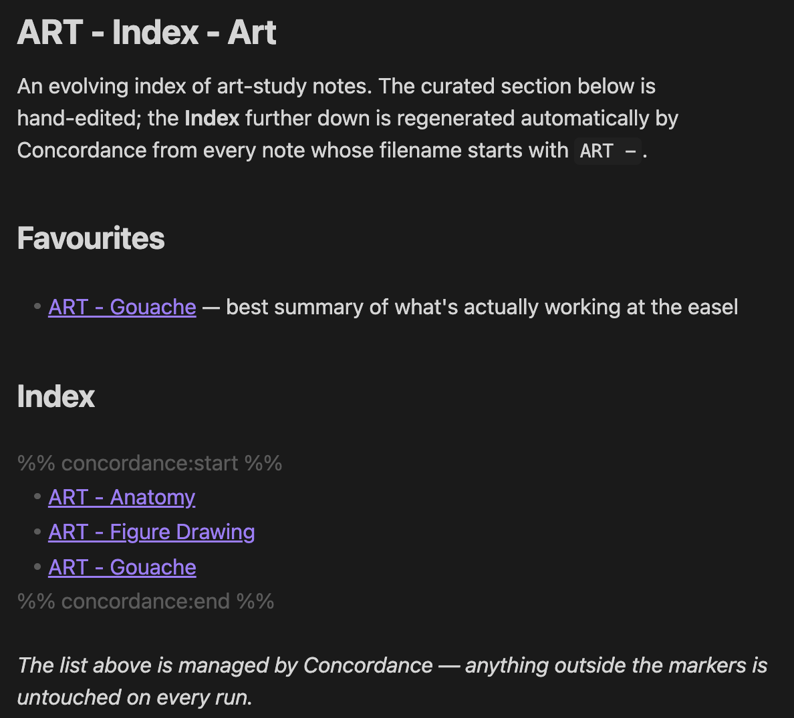
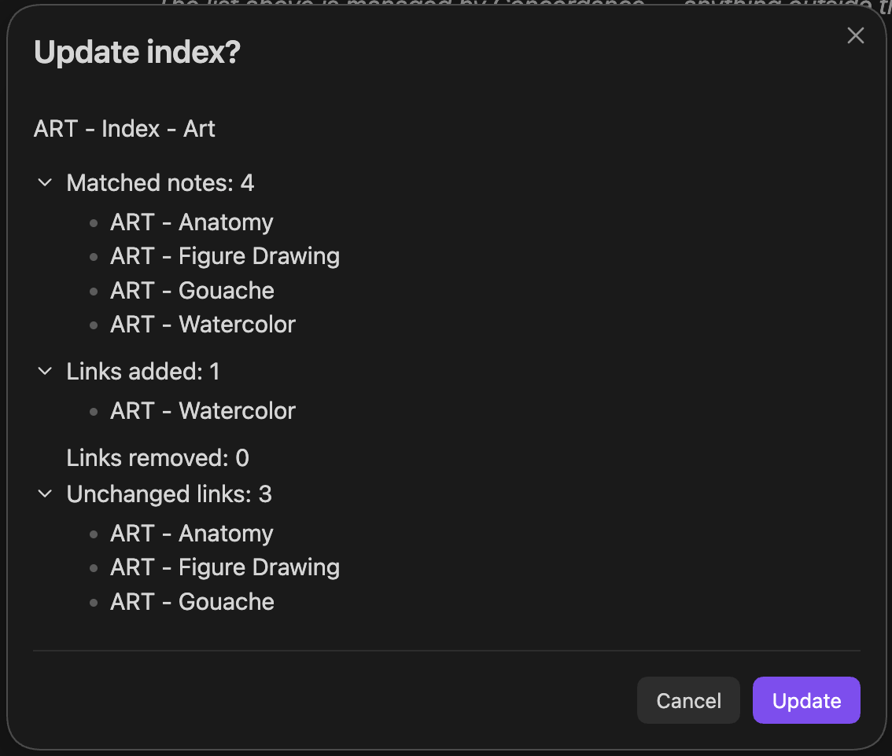
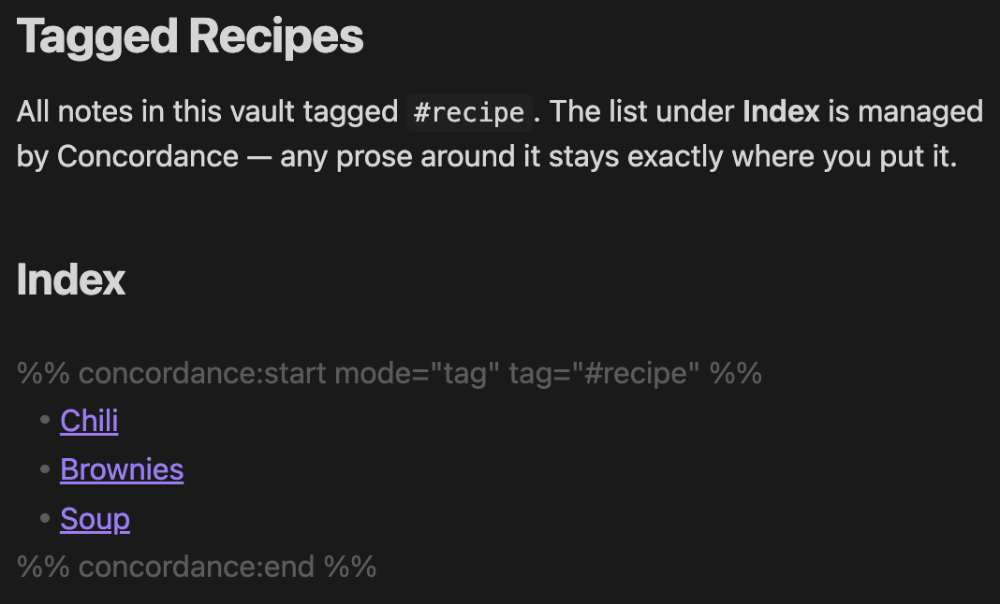

# Concordance

Generate safe Markdown indexes from folders, tags, properties, and filename patterns.

Concordance writes a list of `[[wikilinks]]` into a clearly-marked block in any
note you designate as an index. Content outside the block is never touched, so
your indexes can mix prose, headings, callouts, and the auto-generated list in
one file.

## Features

- **Four ways to scope an index** in a single plugin:
  - `prefix` — files whose name starts with a configurable template (default
    `{PREFIX} -` plus a space)
  - `folder` — files inside a folder (optionally recursive)
  - `tag` — files carrying a tag (inline or frontmatter)
  - `property` — files whose frontmatter property equals a given value
- **Safe, contained edits.** Only the content between `%% concordance:start %%`
  and `%% concordance:end %%` is rewritten. Headings, notes, and other prose
  outside the block are left alone.
- **Diff-before-write modals** for single and bulk updates so you can see what
  will be added or removed before saving.
- **Read-only check command** to preview pending changes across the vault
  without modifying anything.
- **Configurable link style and sort** per index block (`name` vs full path,
  by `name` vs `path`).
- **Exclusions** for folders and filename substrings, applied to every mode.

## Screenshots

A Concordance-managed index file. The list inside the `%% concordance %%`
markers is regenerated each run; everything outside is yours.



The update modal shows exactly what will change — links added, removed, and
unchanged — before any file is written to disk.



Marker attributes drive non-prefix modes. Tag, folder, and frontmatter
property indexes are all configured the same way — just by editing the
options in the start marker.



## Installation

### From the Community Plugins browser (after acceptance)

1. In Obsidian, open **Settings → Community plugins**.
2. Disable Restricted mode if necessary.
3. Select **Browse**, search for **Concordance**, and install.
4. Enable the plugin.

### Manual install

1. Download `main.js`, `manifest.json`, and `styles.css` from the latest release.
2. Copy them into `<vault>/.obsidian/plugins/concordance/`.
3. Reload Obsidian and enable Concordance in **Settings → Community plugins**.

## Quick start

There are two ways to turn a note into an index.

### A. Filename-based prefix index

Create a note whose name matches the configured index template
(default `{PREFIX} - Index - {DISPLAY_NAME}`), e.g. `ART - Index - Art`. Open it
and run **Concordance: Update current index**. Concordance asks once whether to
insert the managed block, then fills it with links to every other note whose
name starts with the `ART -` prefix.

### B. Marker-driven index (any filename)

Add a managed block to any note. The attributes inside the start marker tell
Concordance how to populate it:

```markdown
## Recipes

%% concordance:start mode="folder" folder="Recipes" includeSubfolders="true" %%
%% concordance:end %%
```

Run **Concordance: Update current index** on the note. The body between the
markers is replaced with the generated list.

## Commands

| Command                          | What it does                                                |
| -------------------------------- | ----------------------------------------------------------- |
| Update current index             | Compute and apply the update for the active note.           |
| Update all indexes               | Bulk-update every detected index after a confirmation step. |
| Check indexes for updates        | Read-only diff of every index. Nothing is written.          |

## Block attribute reference

Attributes are written inside the start marker as `key="value"` pairs.

| Attribute           | Modes      | Values                                    | Default        |
| ------------------- | ---------- | ----------------------------------------- | -------------- |
| `mode`              | all        | `prefix`, `folder`, `tag`, `property`     | `prefix`       |
| `folder`            | `folder`   | vault-relative path (empty = whole vault) | _index folder_ |
| `includeSubfolders` | `folder`   | `true`, `false`                           | `false`        |
| `tag`               | `tag`      | `#tag` or `tag` (leading `#` added)       | —              |
| `property`          | `property` | frontmatter key                           | —              |
| `value`             | `property` | frontmatter value to match                | —              |
| `linkStyle`         | all        | `auto`, `name`, `path`                    | `auto`         |
| `sort`              | all        | `name`, `path`                            | `path`         |

`linkStyle="auto"` picks the basename for in-folder matches and the full path
for subfolder matches so wikilinks resolve unambiguously.

### Examples

```markdown
%% concordance:start mode="tag" tag="#recipe" sort="name" %%
%% concordance:end %%
```

```markdown
%% concordance:start mode="property" property="type" value="recipe" %%
%% concordance:end %%
```

```markdown
%% concordance:start mode="folder" folder="Projects/Active" includeSubfolders="true" linkStyle="path" %%
%% concordance:end %%
```

## Settings

- **Index note filename template** — pattern used to discover prefix-mode index
  notes. Must include `{PREFIX}` and `{DISPLAY_NAME}`.
- **Child note filename prefix template** — what prefix-mode child notes start
  with. Must include `{PREFIX}`.
- **Start / end markers** — the literal strings that delimit the managed block.
  The defaults use Obsidian's comment syntax so the markers do not render in
  preview mode.
- **Missing-block heading** — heading inserted just above a newly added block.
- **Missing-block behaviour** — `Ask` shows a confirmation modal before adding
  a marker pair to an index that has none; `Never` silently skips such files.
- **Excluded folders** — paths to skip in every mode.
- **Excluded note name terms** — substrings to skip in every mode.

## Safety model

- Concordance only writes between `%% concordance:start %%` and
  `%% concordance:end %%`. Everything else in the file is preserved.
- If the markers are missing or duplicated, no write happens and you receive a
  notice describing the problem.
- All updates go through a confirmation modal that lists what will be added and
  removed before any file is touched.

## Contributing

Build instructions, project layout, and release workflow live in
[CONTRIBUTING.md](./CONTRIBUTING.md). Changelog is in
[CHANGELOG.md](./CHANGELOG.md).

## Disclosure

Developed with assistance from AI. All changes are reviewed and tested by the
maintainer.

## License

MIT — see [LICENSE](./LICENSE).
